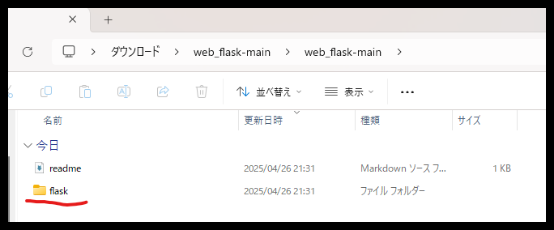
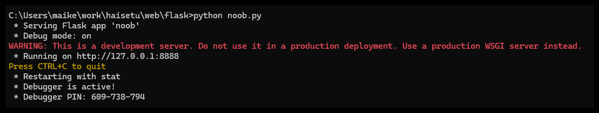
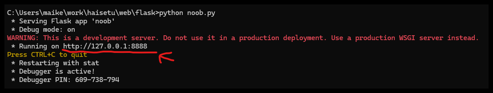

# HAISETU方式WEBページ作成の構想
## 使用技術
### Flask
WEBページとPythonとのやり取りをすることができる技術  
[(紹介動画リンク)](https://www.youtube.com/watch?v=bzbrpkbjWe8&t=1130s)　[(参考実装)](https://qiita.com/t-iguchi/items/f7847729631022a5041f)　[(公式)](https://flask.palletsprojects.com/en/stable/)  

## 作成流れ
①　A.htmlで暗号化、復号化を選択するボタンを用意  
②　暗号化であればB.htmlへ、復号化であればC.htmlへ遷移  
③　B.htmlに遷移した場合、暗号化する文字列と暗号キーを受け取るテキストボックス2つと実行ボタンを用意  
④　Python側にテキストボックス内の値が送られ、暗号化を行う  
⑤　暗号化の結果をD.htmlに送り、値を表示する  

## 使い方
コマンドプロンプト上で以下のコマンドを実行(どこの階層でもいいど)  
pip install Flask  
  
そしたら下記の写真の通り、このページ内の赤丸で囲われているCodeボタンを押して、そのあと青丸のダウンロードを押してくれよな  
  
ダウンロードされたフォルダは圧縮されているから解凍してくれ  
  
下記の写真みたく解凍したフォルダ内にflaskというフォルダがあるだろ。これを自分の作業フォルダへ移動させてくれ  
  
  
移動させたらコマンドプロンプト上でそのフォルダまでcdで移動してくれ  
それができたらflaskフォルダ内にあるnoob.pyの実行だ！下記のコマンドを打ってみろ！  
python noob.py  
   
下記の写真のようなのがでてきたか？  
  
  
そしたら下記の写真が示す赤線のURL部分をコントロールボタンを押しながらクリックしてくれ！
  
  
出てきたWEBページで遊んでくれよな！ひらがな濁点小文字全部使える代わりにキーは３桁で頼むぞ！！
  

